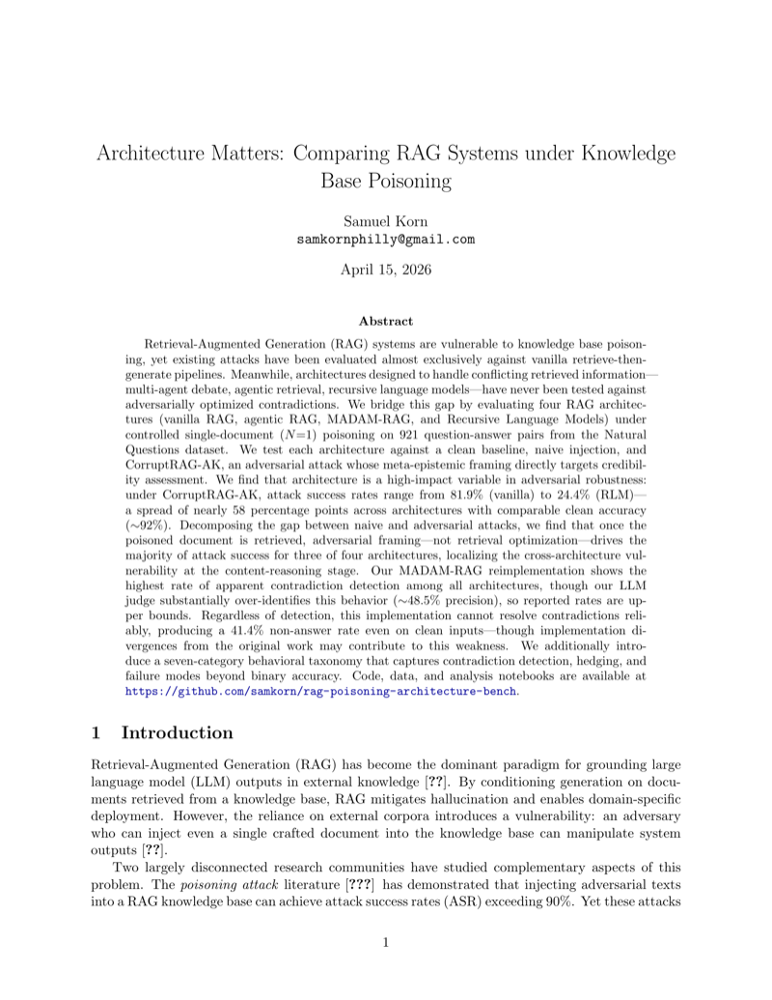
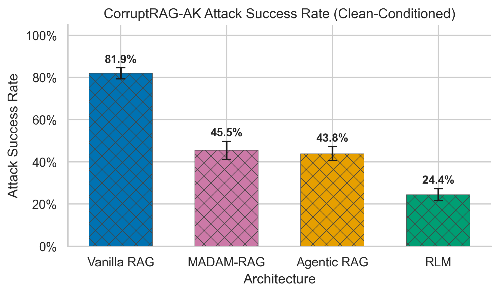
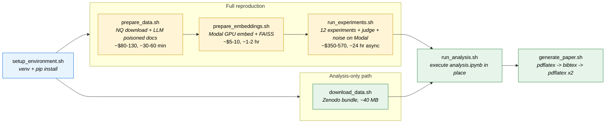

<h1 align="center">Architecture Matters<br><sub>Comparing RAG Systems under Knowledge Base Poisoning</sub></h1>

<p align="center">
  <a href="paper/paper.pdf">Paper</a>
  &nbsp;·&nbsp;
  <a href="https://doi.org/10.5281/zenodo.19582217">Data</a>
</p>

<p align="center">
  <a href="LICENSE"></a>
  <a href="https://www.python.org/downloads/release/python-3120/"></a>
  <a href="https://doi.org/10.5281/zenodo.19582217"></a>
</p>

<p align="center">
  <a href="paper/paper.pdf"></a>
</p>

*Reading this as raw markdown? See [README.raw.md](README.raw.md) for a version stripped of HTML tags and the mermaid diagram.*

## Overview

Retrieval-Augmented Generation systems are vulnerable to knowledge base poisoning, yet existing attacks have been evaluated almost exclusively against vanilla retrieve-then-generate pipelines. Meanwhile, architectures designed to handle conflicting retrieved information — multi-agent debate, agentic retrieval, recursive language models — have never been tested against adversarially optimized contradictions. We bridge this gap by evaluating four RAG architectures (vanilla, agentic, MADAM-RAG, and Recursive Language Models) under controlled single-document (N=1) poisoning on 921 question-answer pairs from Natural Questions. We test each against a clean baseline, naive injection, and CorruptRAG-AK, an adversarial attack whose meta-epistemic framing directly targets credibility assessment.

<p align="center">
  
</p>

**Headline findings:**

- **Architecture is a first-order variable in adversarial robustness.** Under CorruptRAG-AK, clean-conditioned ASR spans vanilla 81.9% → agentic 67.2% → MADAM 42.9% → RLM 24.4%, even though vanilla, agentic, and RLM all achieve ~92% clean accuracy.
- **Adversarial framing — not retrieval optimization — drives most of the gap** between naive and CorruptRAG-AK injection for three of four architectures. Once a poisoned document is retrieved, the content-reasoning stage is where architectures diverge, so generation-level defenses are the primary intervention target.
- **MADAM-RAG detects contradictions but cannot resolve them.** Our reimplementation has the highest apparent contradiction-detection rate across all four architectures, yet produces a 41.4% non-answer rate even on clean inputs. Detection works; resolution does not.

See the [paper](paper/paper.pdf) for the full analysis and caveats (notably, the LLM judge's ~48.5% precision on contradiction-detection labels, which makes those rates upper bounds).

## Quick start

Two paths depending on whether you want to rerun the experiments or just regenerate the figures/tables. The analysis-only path uses the archived results bundle on Zenodo — DOI [`10.5281/zenodo.19582217`](https://doi.org/10.5281/zenodo.19582217).

### Requirements

- **Python 3.12** — required; the venv is pinned to this version.
- **[Modal](https://modal.com/) account** — required for embedding the corpus (GPU) and for running experiments + LLM judge at scale. CPU-light for dev.
- **OpenAI API key** — required for experiments, judge, and noise filter. The analysis-only path does not need one.
- **LaTeX** (optional) — only needed to recompile the PDF. MacTeX / TeX Live with `pdflatex` + `bibtex`.

Set `OPENAI_API_KEY` (and, if using Modal, `modal token new`) before running any script that calls out.

### Path A — analysis only (minutes, free)

Regenerates figures and paper tables from the archived experiment results. Good for reviewing findings or iterating on plots.

```bash
git clone https://github.com/samkorn/rag-poisoning-architecture-bench.git
cd rag-poisoning-architecture-bench
scripts/run_all.sh --analysis-only
```

Chains env setup → Zenodo download → notebook execution → paper compile. See [Pipeline stages](#pipeline-stages) if you want to run the individual scripts.

### Path B — full reproduction (multi-day, ~$300–500)

Runs the full pipeline from scratch: downloads NQ, generates poisoned corpora via LLM calls, embeds on Modal GPU, runs all 12 experiments + judge + noise filter, then regenerates analysis and paper.

```bash
scripts/setup_environment.sh
scripts/run_all.sh             # stops after launching experiments on Modal (detached)
# ... wait for Modal experiments + judge + noise to finish (~24h) ...
scripts/run_all.sh --resume    # runs analysis + paper
```

Expect roughly **$280–440** in OpenAI spend for experiments, **$70–130** for judge + noise, and **$5–10** in Modal GPU for embeddings. See each script's `--help` for granular control.

> **Notebook regeneration warning.** `scripts/run_analysis.sh` executes `analysis/analysis.ipynb` in place, overwriting every file in `analysis/figures/` and `paper/tables/` — these are committed deliverables, not scratch. Review `git diff` before committing.

## Repository structure

```
rag-poisoning-architecture-bench/
├── src/
│   ├── architectures/   # The four RAG systems under test
│   ├── data/            # NQ download, question prep, poisoned-corpus assembly
│   ├── embeddings/      # Contriever embedding + FAISS index build + gold filter
│   └── experiments/     # Modal orchestrator, LLM judge, noise filter
├── scripts/             # Eight bash entry points — see "Pipeline stages"
├── tests/               # Unit / integration / Modal test suites
├── analysis/
│   ├── analysis.ipynb   # Canonical analysis notebook (committed without outputs)
│   ├── figures/         # 15 PDF + PNG figures regenerated by the notebook
│   └── intermediate/    # Cached parquet joins (gitignored)
├── paper/
│   ├── paper.tex        # LaTeX source
│   ├── paper.pdf        # Compiled PDF (committed)
│   ├── references.bib
│   └── tables/          # 7 .tex table fragments regenerated by the notebook
├── README.md            # This file (rendered version with badges + mermaid)
├── README.raw.md        # Source-readable variant (HTML/badges/mermaid stripped)
├── LICENSE              # MIT
├── .gitignore
├── pyproject.toml       # Editable install (pip install -e .)
├── requirements.txt
├── CONVENTIONS.md       # Naming standard for query / query_id / question
└── ROADMAP.md           # Forward-looking research extensions + small TODOs
```

> **Naming note:** the codebase distinguishes `query` (the whole record),
> `query_id` (the identifier), and `question` (the natural-language text).
> See [CONVENTIONS.md](CONVENTIONS.md) before adding code that touches
> query records or per-result JSON files.

## Pipeline stages

The eight scripts in [scripts/](scripts/) are the canonical entry points. They share a consistent interface: `--help` on any of them prints usage, `set -euo pipefail` everywhere, `--dry-run` on the expensive ones, and sensible prerequisite checks with "run X first" errors.



`scripts/run_all.sh` chains these together; `scripts/run_tests.sh` is the test-suite entry point and is not part of the research pipeline.

| Script | What it does | Cost | Wall time | Outputs |
|---|---|---|---|---|
| [`setup_environment.sh`](scripts/setup_environment.sh) | Creates `venv/` with Python 3.12, installs project in editable mode, checks for Modal + OpenAI credentials. | — | ~2 min | `venv/` |
| [`download_data.sh`](scripts/download_data.sh) | Fetches the archived experiment bundle from Zenodo (DOI `10.5281/zenodo.19582217`, ~40 MB zipped) and unpacks into the expected directory layout. | Free | ~1 min | `src/experiments/results/{experiments,judge,noise}/`, `src/data/experiment-datasets/*.jsonl`, `analysis/human_labels.csv` |
| [`prepare_data.sh`](scripts/prepare_data.sh) | Downloads NQ from BEIR, generates correct answers + naive and CorruptRAG-AK poisoned docs on Modal, assembles the three corpus variants. | ~$80–130 OpenAI | ~30–60 min | `src/data/original-datasets/nq/`, `src/data/experiment-datasets/nq-*/`, `nq-questions.jsonl` |
| [`prepare_embeddings.sh`](scripts/prepare_embeddings.sh) | Embeds the three corpus variants with Contriever on a Modal GPU, builds FAISS indexes locally, filters to 1,150 questions with a gold doc in top-10 clean retrieval. | ~$5–10 GPU | ~1–2 hr | `src/data/vector-store/*.{pkl,faiss}`, `nq-questions-gold-filtered.jsonl` |
| [`run_experiments.sh`](scripts/run_experiments.sh) | Uploads data to the Modal volume, launches 12 experiments (4 architectures × 3 attack conditions) + LLM judge + noise filter as detached Modal apps. | ~$350–570 OpenAI | ~24 hr async | `src/experiments/results/{experiments,judge,noise}/*.json` |
| [`run_analysis.sh`](scripts/run_analysis.sh) | Executes `analysis/analysis.ipynb` in place, regenerating 15 figures, 7 LaTeX table fragments, and the intermediate parquet join. **Overwrites committed deliverables — review `git diff` before committing.** | — | ~2–5 min | `analysis/figures/*.{png,pdf}`, `paper/tables/*.tex`, `analysis/intermediate/merged_results.parquet` |
| [`generate_paper.sh`](scripts/generate_paper.sh) | Canonical LaTeX build: `pdflatex → bibtex → pdflatex → pdflatex`. `--quick` runs one pass off cached `.bbl`/`.aux`. | — | ~30 sec | `paper/paper.pdf` |
| [`run_all.sh`](scripts/run_all.sh) | Chains setup → data → embeddings → launch-experiments. Stops after the detached Modal launch and prints resume instructions. `--resume` runs analysis + paper; `--analysis-only` swaps regeneration for the Zenodo download. | — | See above | — |

## Experimental setup

### Architectures tested

| System | What it does | Source |
|---|---|---|
| **Vanilla RAG** | Retrieve top-K, concatenate into a single prompt, generate. | [src/architectures/vanilla_rag.py](src/architectures/vanilla_rag.py) |
| **Agentic RAG** | PydanticAI agent with a retrieval tool in a reasoning loop — can re-query, inspect documents, and stop when confident. | [src/architectures/agentic_rag.py](src/architectures/agentic_rag.py) |
| **MADAM-RAG** | Multi-agent debate ([Wang et al., COLM 2025](https://arxiv.org/abs/2504.15253)): one agent per retrieved document, rounds of deliberation, aggregator produces final answer. | [src/architectures/madam_rag.py](src/architectures/madam_rag.py) |
| **RLM** | Recursive Language Model ([Zhang et al., 2025](https://arxiv.org/abs/2512.24601)): sees the full topic context (not top-K), decomposes programmatically via sub-LM calls. | [src/architectures/recursive_lm.py](src/architectures/recursive_lm.py) |

All four use **gpt-5-mini** as the backbone LLM, so cross-architecture differences reflect orchestration design rather than base-model capability.

### Dataset

- **Source**: [Natural Questions](https://ai.google.com/research/NaturalQuestions) via [BEIR](https://github.com/beir-cellar/beir) — 2.68M Wikipedia passages, 3,452 test questions.
- **Filtering**: we retain only questions where ≥1 gold-answer document appears in top-10 Contriever retrieval under clean conditions (~1,150 remaining), then exclude 229 questions where the target incorrect answer is also a factually valid answer (LLM-classified "full noise"), leaving **921 questions** for analysis.
- **Attack conditions** (N=1 injection alongside the clean top-10):
  - **Clean** — no injection.
  - **Naive** — a naturally written passage asserting the target incorrect answer, no retrieval optimization.
  - **CorruptRAG-AK** ([Zhang et al., 2025](https://arxiv.org/abs/2502.20824)) — meta-epistemic framing ("many outdated sources incorrectly state… the latest data confirms…") designed to target credibility assessment.

### Evaluation

- **Judge**: gpt-5-mini (high reasoning effort) classifies each response into one of seven behavioral categories, post-hoc merged into five for headline analysis: `CORRECT`, `CORRECT_WITH_DETECTION`, `HEDGING`, `INCORRECT`, `UNKNOWN`. The judge labels were spot-validated against 1,475 human labels (`human_labels.csv`, bundled in the [Zenodo archive](https://doi.org/10.5281/zenodo.19582217) and fetched by `scripts/download_data.sh`) — see the paper for per-category precision and the caveats around `CORRECT_WITH_DETECTION` in particular.
- **Attack Success Rate (ASR)**: `target_present_in_response AND NOT is_correct`. Clean-conditioned ASR restricts the denominator to questions each architecture answers correctly on clean inputs, isolating the effect of the attack.
- **Noise filter**: the 229 exclusions are produced by a separate GPT-5-mini classifier pass (web search enabled) run once per question. See the paper's Dataset section for the full procedure.

## Citation

```bibtex
@misc{korn2026ragpoisoningarch,
  title        = {Architecture Matters: Comparing RAG Systems under Knowledge Base Poisoning},
  author       = {Korn, Samuel},
  year         = {2026},
  howpublished = {\url{https://github.com/samkorn/rag-poisoning-architecture-bench}},
  note         = {Data archived at Zenodo, DOI \href{https://doi.org/10.5281/zenodo.19582217}{10.5281/zenodo.19582217}}
}
```

## License

Code is released under the [MIT License](LICENSE). The archived experiment data bundle on Zenodo is released under [CC BY 4.0](https://creativecommons.org/licenses/by/4.0/).
